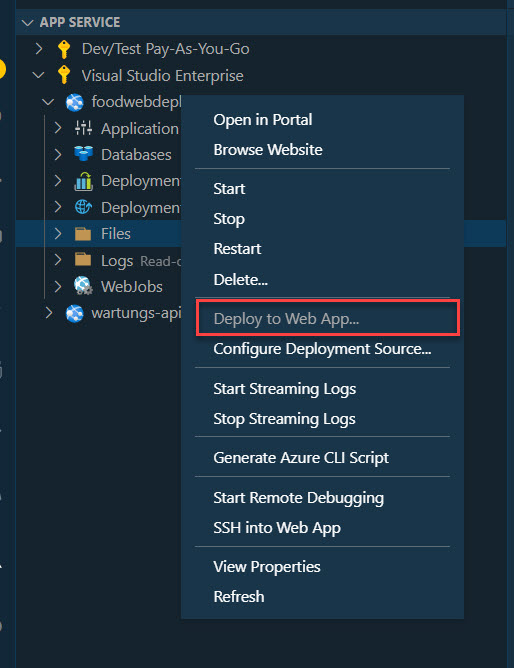
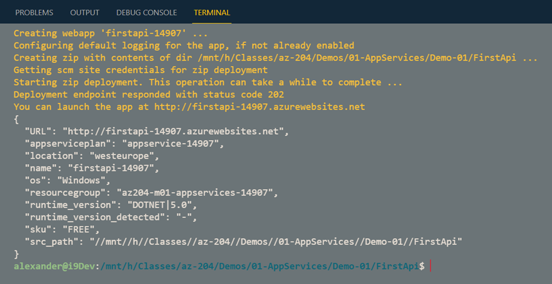

# Create App Service & Publish .NET Core Api using Portal & CLI

- Using VS Extension
- Publishing Profile
- az webapp up
- [Use Azure Dev Ops (optional)](https://github.com/arambazamba/mvc-devops/blob/master/az-pipelines/build-provision-deploy.yml)
- GitHub Actions  (optional)

## Scaffold App & Deploy using Azure App Service Extensions

Use [.NET Core CLI](https://docs.microsoft.com/en-us/dotnet/core/tools/). 

Scaffold and run App:

```bash
dotnet new api -n cli-api
dotnet run
```

Publish app

```bash
dotnet publish
```

Deploy App using [Azure App Service](https://marketplace.visualstudio.com/items?itemName=ms-azuretools.vscode-azureappservice)



## Deploy using Publishing Profile

Navigate to `./publishing-profile/Properties/PublishProfile`

Add a file called `azure.pubxml` with the following content:

```xml
<Project>
    <PropertyGroup>
    <PublishProtocol>Kudu</PublishProtocol>
    <PublishSiteName>{Your App name}</PublishSiteName>
    <UserName>{Your FTP/deployment username}</UserName>
    <Password>{Your FTP/deployment password}</Password>
    </PropertyGroup>
</Project>
```

Get the publishing metadata to update `azure.pubxml`:

```
user=$(az webapp deployment list-publishing-profiles -g $grp -n $mvcapp --query [1].userName -o tsv)
pwd=$(az webapp deployment list-publishing-profiles -g $grp -n $mvcapp --query [1].userPWD -o tsv)

echo "Update your publishing Profile:"
echo "PublishSiteName: $mvcapp"
echo "UserName: $user"
echo "Password: $pwd"
```

Publish app:

```
dotnet publish /p:Configuration=Release /p:PublishProfile=Properties\PublishProfiles\azure.pubxml /p:Password=<password>
```

> Note: Make sure you use the published path

## Deploy using az webapp up

Create an app service plan and a web app:

```bash
rnd=$RANDOM
grp=az204-m01-appservices-$rnd
loc=westeurope
appPlan=appservices-$rnd
app=blazorapp-$rnd
az group create -n $grp -l $loc
az appservice plan create -n $appPlan -g $grp --sku Free
az webapp create -n $app -g $grp --plan $appPlan --runtime "DOTNET|5.0"
```

`az webapp up` is a shortcut to, build, publishes and deploys the web app. Navigate to `./blazor-wasm-app/` and execute:


```bash
rnd=$RANDOM
grp=az204-m01-appservices-$rnd
loc=westeurope
appPlan=appservices-$rnd
app=blazorapp-$rnd

az group create -n $grp -l $loc
az webapp up -n $app -g $grp -p $appPlan -l $loc --sku Free -r "DOTNET|5.0"
```



# Deployment using GitHub Actions

- Execute `create-webapp.azcli`

Demo Steps:

- Creat App Service Plan & Deploy Api using GitHub Actions
- Swap Slots

> Note: FoodApp is a seperate Git Repo: [https://github.com/ARambazamba/FoodApp](https://github.com/ARambazamba/FoodApp)

Deploy Api using [GitHub Actions](https://github.com/Azure/actions) and fix the path in the [DOTNET CLI](https://docs.microsoft.com/en-us/dotnet/core/tools/) tasks in order to avoid path issues becaus of monorepo-pattern.

Your workflow file, execpt the connection info should look like this:

```yaml
name: Build and deploy ASP.Net Core app to Azure Web App - foodapi-007

on:
  push:
    branches:
      - master

jobs:
  build-and-deploy:
    runs-on: windows-latest

    steps:
      - uses: actions/checkout@master

      - name: Set up .NET Core
        uses: actions/setup-dotnet@v1
        with:
          dotnet-version: "5.0.x"

      - name: Build with dotnet
        run: dotnet build ${{ github.workspace }}/FoodApi/FoodApi.csproj --configuration Release

      - name: dotnet publish
        run: dotnet publish ${{ github.workspace }}/FoodApi/FoodApi.csproj -c Release -o ${{env.DOTNET_ROOT}}/myapp

      - name: Deploy to Azure Web App
        uses: azure/webapps-deploy@v2
        with:
          app-name: "foodapi-007"
          slot-name: "production"
          publish-profile: ${{ secrets.AzureAppService_PublishProfile_dfa93fdd00d148a19ae19d4b90d30039 }}
          package: ${{env.DOTNET_ROOT}}/myapp
```
