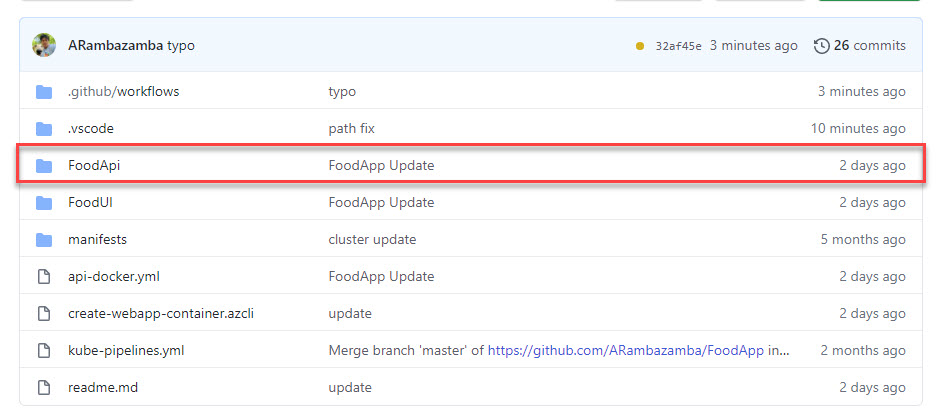

# App Services - Food App

- .NET 5 Web Api using SQLLite
- Angular UI

Demo Steps:

- Creat App Service Plan & Deploy Api using GitHub Actions
- Swap Slots

> Note: FoodApp is a seperate Git Repo: [https://github.com/ARambazamba/FoodApp](https://github.com/ARambazamba/FoodApp)

## Deploy Api

- Execute `create-webapp.azcli`

## Upload Content using GitHub Actions

Deploy Api using [GitHub Actions](https://github.com/Azure/actions) and fix the path in the [DOTNET CLI](https://docs.microsoft.com/en-us/dotnet/core/tools/) tasks in order to avoid path issues



Your workflow file, execpt the connection info should look like this:

```yaml
name: Build and deploy ASP.Net Core app to Azure Web App - foodapi-007

on:
  push:
    branches:
      - master

jobs:
  build-and-deploy:
    runs-on: windows-latest

    steps:
      - uses: actions/checkout@master

      - name: Set up .NET Core
        uses: actions/setup-dotnet@v1
        with:
          dotnet-version: "5.0.x"

      - name: Build with dotnet
        run: dotnet build ${{ github.workspace }}/FoodApi/FoodApi.csproj --configuration Release

      - name: dotnet publish
        run: dotnet publish ${{ github.workspace }}/FoodApi/FoodApi.csproj -c Release -o ${{env.DOTNET_ROOT}}/myapp

      - name: Deploy to Azure Web App
        uses: azure/webapps-deploy@v2
        with:
          app-name: "foodapi-007"
          slot-name: "production"
          publish-profile: ${{ secrets.AzureAppService_PublishProfile_dfa93fdd00d148a19ae19d4b90d30039 }}
          package: ${{env.DOTNET_ROOT}}/myapp
```
