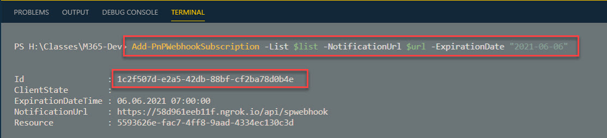

# SharePoint Webhook Getting Started

- Execute `create-func-app.azcli` to create an Azure Function
- Run `sp-webhook` project using `func start --build`
- Download [ngrok](https://ngrok.com/) to forward your local address
- Run `ngrok http 7071` and note the ngrok url


- Subscribe to SharePoint Webhooks using `create-wh-subscription.ps1`. Update `$url` before executing. Write down the subscription id for cleanup



- Add an item to the SharePoint Skills list and wait for the webhook notification. It should look like this:

```json
{
  "subscriptionId": "1c2f507d-e2a5-)42db-88bf-cf2ba78d0b4e",
  "clientState": null,
  "expirationDateTime": "2021-06-06T07:00:00Z",
  "resource": "5593626e-fac7-4ff8-9aad-4334ec130c3d",
  "tenantId": "d92b247e-90e0-4469-a129-6a32866c0d0a",
  "siteUrl": "/sites/M365Dev",
  "webId": "e2f36f29-3e84-4e0c-888a-572169727ea6"
}
```

> Note: This [article](https://blog.josephvelliah.com/using-azure-functions-with-sharepoint-webhooks) shows how to get changes using CSOM
