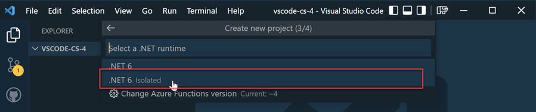

# Azure Function Core Tools

[Work with Azure Functions Core Tools](https://docs.microsoft.com/en-us/azure/azure-functions/functions-run-local?tabs=v3%2Cwindows%2Ccsharp%2Cportal%2Cbash)

[host.json Reference](https://docs.microsoft.com/en-us/azure/azure-functions/functions-host-json)

## Demo

### Environment Setup

Install azure-function-tools:

```
npm i -g azure-functions-core-tools@4 --unsafe-perm true
```

Install [Azurite Storage Emulation](https://docs.microsoft.com/en-us/azure/storage/common/storage-use-azurite?tabs=visual-studio):

```bash
npm install -g azurite
```

Run Azurite in console:

```bash
azurite
```

### Selecting Runtime Version

Install [Azure Function - Visual Studio Code Extension](https://marketplace.visualstudio.com/items?itemName=ms-azuretools.vscode-azurefunctions)





### Testing Options

To Execute REST Calls you could use:

-   [REST Client - Visual Studio Code Extension](https://marketplace.visualstudio.com/items?itemName=humao.rest-client) with [instructions](https://github.com/Huachao/vscode-restclient/blob/master/README.md)
-   [az rest](https://docs.microsoft.com/en-us/cli/azure/reference-index?view=azure-cli-latest#az_rest)
-   [Postman](https://www.postman.com/)
-   [httprepl](https://docs.microsoft.com/en-us/aspnet/core/web-api/http-repl/?view=aspnetcore-6.0&tabs=windows)

Install httprepl which used in labs:

```
dotnet tool install -g Microsoft.dotnet-httprepl
```

## Demo VS Code Function Apps

Create Funtion App in Azure by executing `create-vscode-app.azcli`

Create a function project:

```
func init vscode-func --dotnet
```

Create a new Function:

```
func templates list
func new -n GreetingFunctions --template "Http Trigger"
```

>  **Note**: If you get an `No templates found matching: 'HTTPtrigger'` error this can be caused by multible versions of the .NET SDK being installed on your machien. You can fix this issue by creating a `global.json` using `dotnet new globaljson` an by setting the correct framework version.

Run function locally:

```
func start
```

Use az rest in another terminaln instance:

```bash
az rest -m post -u http://localhost:7071/api/MyHttpTrigger -b "{'name':'Azure Rocks'}"
```

Use `REST Client` and execute `send-greeting.http`:

```bash
@baseurl=localhost:7071

### Greet Hubertus using GET
GET  http://{{baseurl}}/api/greetme?name=Hubertus HTTP/1.1
content-type: application/json
```

Publish App to Azure using CLI:

```bash
func azure functionapp publish $app
```
