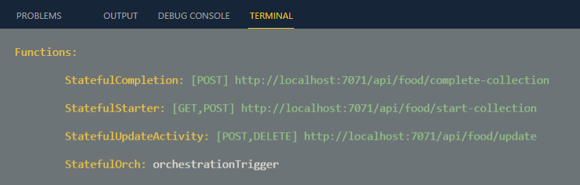

# Durable Functions

[Durable Functions Getting Started Walkthrough](https://docs.microsoft.com/en-us/azure/azure-functions/durable/quickstart-js-vscode)

## Demos 

- Stateful Durable Function
- Basic Workflow / Human Intervention

### Stateful Durable Function

Functions in project `stateful-cs`:



### Basic Workflow / Human Intervention

Functions in project `foodpic-approval-cs`:

## Readings

[Azure Durable Functions Documentation](https://docs.microsoft.com/en-us/azure/azure-functions/durable/)

[Durable Function HTTP API reference](https://docs.microsoft.com/en-us/azure/azure-functions/durable/durable-functions-http-api)

[Developer's guide to durable entities in .NET](https://docs.microsoft.com/en-us/azure/azure-functions/durable/durable-functions-dotnet-entities)

## Durable Prerequisites

[Azure Functions Durable Extensions](https://github.com/Azure/azure-functions-durable-extension)

> Note: Search on NuGet for other [WebJobs.Extensions](https://www.nuget.org/packages?q=Microsoft.Azure.WebJobs.Extensions)

### Installation .NET

Install Durable Functions Package into a specific project:

```
func extensions install -p Microsoft.Azure.WebJobs.Extensions.DurableTask -v 2.5.1
```

or

```
dotnet add package Microsoft.Azure.WebJobs.Extensions.DurableTask --version 2.5.1
```

### Installation Node (JavaScript / TypeScript)

-   Install durable functions npm package: `npm i -S durable-functions@1.5.1`

## Tools & Extensions

[GitHub: Durable Functions Snippets](https://github.com/marcduiker/durable-functions-snippets)