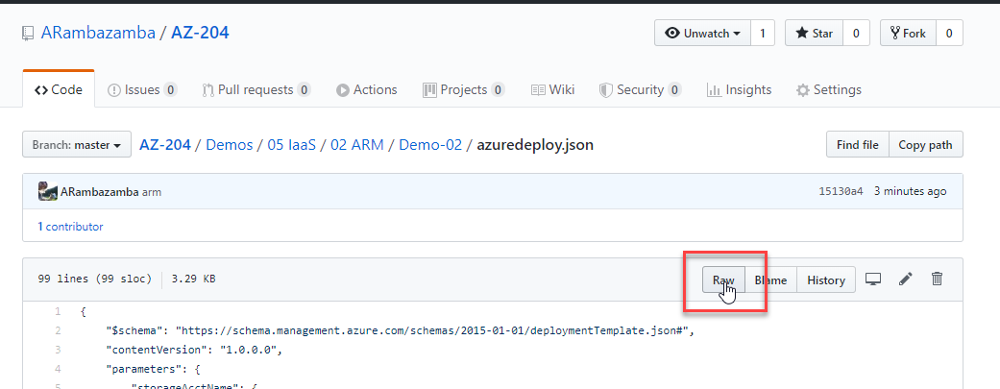

# Deploy to Azure Button

[](https://portal.azure.com/#create/Microsoft.Template/uri/https%3A%2F%2Fraw.githubusercontent.com%2FARambazamba%2FAZ-204%2Fmain%2FDemos%2F05-IaaS%2F02-ARM%2FDemo-02%2Fazuredeploy.json)

Click the button to deploy the ressource to Azure.

---

Result:


## Create a "Deploy to Azure Button"

[Use a deployment button to deploy templates from GitHub repository](https://docs.microsoft.com/en-us/azure/azure-resource-manager/templates/deploy-to-azure-button)

Export or Create a new ARM Template:


Get the raw path for a file use the `Raw-Button`



```
https://raw.githubusercontent.com/ARambazamba/AZ-204/master/Demos/05%20IaaS/02%20ARM/Demo-02/azuredeploy.json
```

Encode the Url using an [Online Encoder](https://www.urlencoder.org/):

```
https%3A%2F%2Fraw.githubusercontent.com%2FARambazamba%2FAZ-204%2Fmaster%2FDemos%2F05%2520IaaS%2F02%2520ARM%2FDemo-02%2Fazuredeploy.json
```

Compose the complete Url:

```
[](https://portal.azure.com/#create/Microsoft.Template/uri/FULL-URL-HERE)
```
