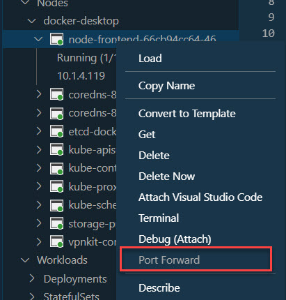

# Helm

[Helm Documentation](https://helm.sh/)

## Installation on Windows

[Get Chocolatey](https://chocolatey.org/install)

`choco install kubernetes-helm`

## Installation on Linux or WSL

```
curl -fsSL -o get_helm.sh https://raw.githubusercontent.com/helm/helm/master/scripts/get-helm-3
chmod 700 get_helm.sh
./get_helm.sh
```

## Using Helm

[Using Helm](https://helm.sh/docs/intro/using_helm/)

[Helm CLI Reference](https://helm.sh/docs/helm/)

Sample: https://github.com/Azure-Samples/helm-charts/tree/master/chart-source/azure-vote

List Repos:

```
helm repo list
```

Install a Repo:

helm install voting azure-samples/azure-vote

Creating a Helm Chart:

```
helm create node-frontend
```

List Cluster:

```
kubectl get service --watch
```

Install Helm Chart:

```
helm install node-frontend node-frontend/
```

List installed helm charts:

```
helm ls
```

Uninstall a helm chart:

```
helm uninstall node-frontend
```

List the pods:

```
kubectl get pods
```

Enable Port forwarding using [Kubernetes VS Code Extension](https://marketplace.visualstudio.com/items?itemName=ms-kubernetes-tools.vscode-kubernetes-tools):



> Note: Chose any vaild config for your machine - ie: 8099:80

Browse to Pod:

```
http://localhost:8099
```


