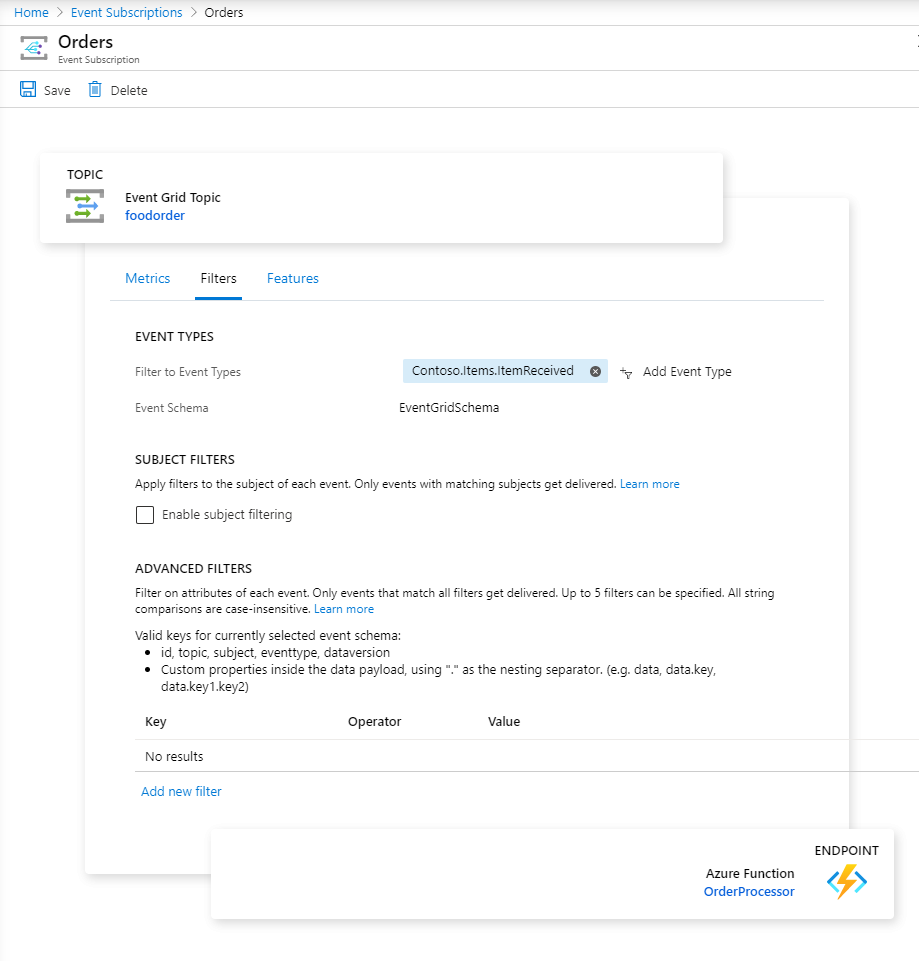

# Consume custom Event

- Execute `create-topic.azcli` to create `foodorder` topic and function app
- Deploy `ConsumeTopic` app to function app
- Create Event Grid Subscription

> Note: Local Debugging can be done using ngrok ... For further details read this [article](https://docs.microsoft.com/en-us/azure/azure-functions/functions-debug-event-grid-trigger-local)
