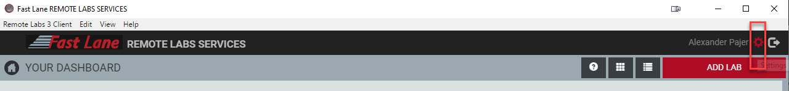
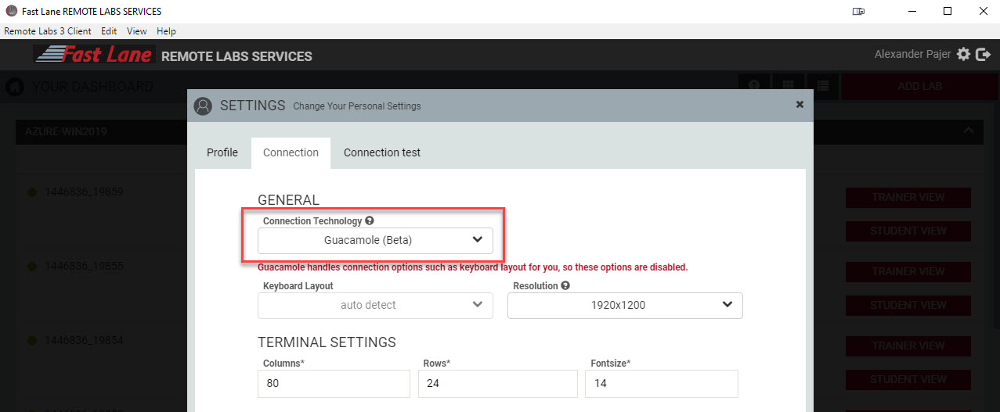
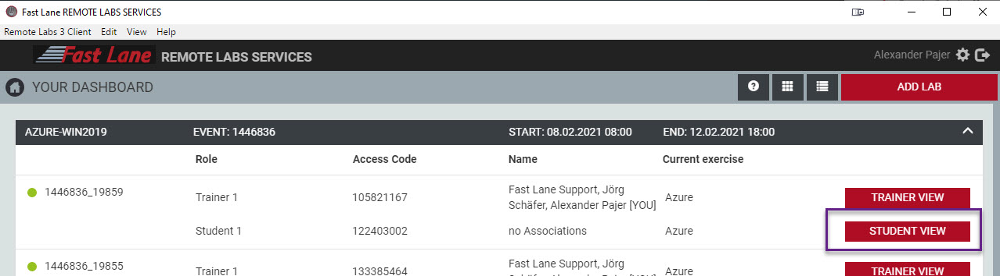

# FastLane Remote Labs

Tou access your training environment with the Remote Labs 3.0 Client. You can download the client from: https://remotelabs.io/rl3/download.

Go to the Settings

Change Settings to `Guacamole` & Save:

Press the "Add a Lab" button and enter your access code:

Select the Lab of your choice

Double click the Windows Icon to start the VM

