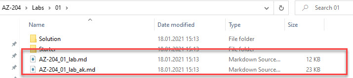

# Labs

The lab guides are available to the folder corresponding to the module.

They contain short guides (\*\_.md) for experienced developers and more detailed guides. I advise you to use the files ending on \*\_ak.md, which are the more detailed guides.

> Note: For better reading experience I recommend reading the lab guides using the browser. Example: https://github.com/ARambazamba/AZ-204/blob/main/Labs/01/AZ-204_01_lab_ak.md

# Lab Machine

- An Azure hosted virtual Azure Windows VM with scriptend Installation
- Your own machine - requires proconfigured sowftware on your Windows 10, Mac, Linux
- Offerend Lab Hostings from your Learning Provider (Microsoft Learning, Lab on Demand, ...)

Detailed Setup instructions for the Azure hosted virtual Azure Windows VM can be found in the [Lab VM Setup Guide](../Setup/readme.md). A gettings started will be given as part of the [Tooling Section]()
