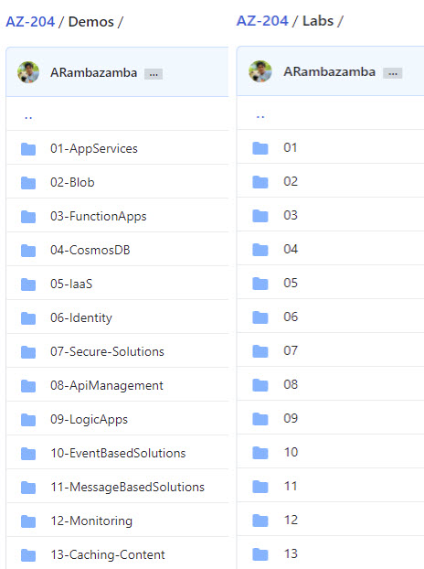
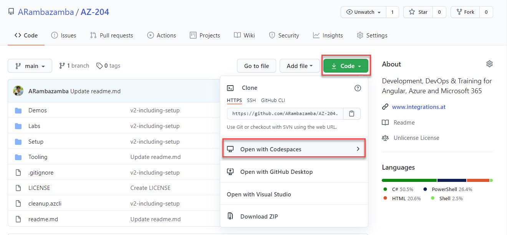
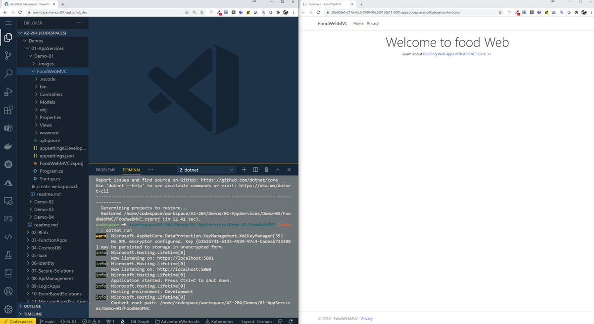

# Labs

The lab guides are available to the folder corresponding to the module.

> Note: For better reading experience I recommend reading the lab guides using the browser. Example: https://github.com/ARambazamba/AZ-204/blob/main/Labs/01/AZ-204_01_lab.md

# Lab Execution

- An Azure hosted virtual Azure Windows VM with scriptend Installation
- Your own machine - requires proconfigured sowftware on your Windows 10, Mac, Linux
- [GitHub Codespaces Preview](https://github.com/features/codespaces)
- Offerend Lab Hostings from your Learning Provider (Microsoft Learning, [Lab on Demand](/00-LOD/), [FastLane Remote Labs](/00-Flane/), ...)

### Lab Machine Setup

Detailed Setup instructions for the Azure hosted virtual Azure Windows VM can be found in the [Lab VM Setup Guide](../Setup/readme.md). An Azure CLI Gettings started will be given as part of the [Tooling Section](../Tooling/readme.md)

### GitHub Codespaces

Open Current Project in Codespaces:

Working in Codespaces. Ports are forwarded:

