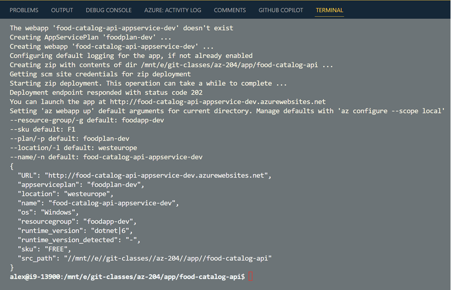

# Create App Service & Publish .NET Core Api using Portal & CLI

- Scaffold & deploy app using Azure App Service Extensions
- Use az webapp up
- Deploy Spring App to Azure App Service (optional)
- Deploy Node App to Azure App Service (optional)

## Scaffold & deploy app using Azure App Service Extensions

Use [.NET Core CLI](https://docs.microsoft.com/en-us/dotnet/core/tools/). 

Scaffold and run App:

```bash
dotnet new mvc -n mvc-app -f net6.0
dotnet run
```

Publish app

```bash
dotnet publish
```

Execute `create-mvc-app.azcli` to create App Service Plan & App Service

Deploy App using [Azure App Service](https://marketplace.visualstudio.com/items?itemName=ms-azuretools.vscode-azureappservice)


## Deploy using Publishing Profile

Navigate to `./publishing-profile/Properties/PublishProfile`

Add a file called `azure.pubxml` with the following content:

```xml
<Project>
    <PropertyGroup>
    <PublishProtocol>Kudu</PublishProtocol>
    <PublishSiteName>{Your App name}</PublishSiteName>
    <UserName>{Your FTP/deployment username}</UserName>
    <Password>{Your FTP/deployment password}</Password>
    </PropertyGroup>
</Project>
```

Get the publishing metadata to update `azure.pubxml`:

```
user=$(az webapp deployment list-publishing-profiles -g $grp -n $mvcApp --query [1].userName -o tsv)
pwd=$(az webapp deployment list-publishing-profiles -g $grp -n $mvcApp --query [1].userPWD -o tsv)

echo "Update your publishing Profile:"
echo "PublishSiteName: $mvcApp"
echo "UserName: $user"
echo "Password: $pwd"
```

Publish app:

```
dotnet publish /p:Configuration=Release /p:PublishProfile=Properties\PublishProfiles\azure.pubxml /p:Password=<password>
```

> Note: Make sure you use the published path

## Deploy net-api using az webapp up

```bash
az webapp up -n $app -g $grp -p $plan --sku F1 -l $loc --runtime "dotnet:8"
```



## Deploy Spring App to Azure App Service (optional)


## Deploy Node App to Azure App Service (optional)
