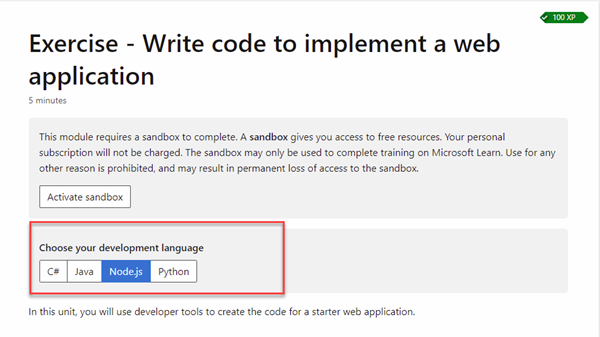

# App Services

## Demos

1. Create and Deploy Web App
    1. Using VS Extension
    2. az webapp up
2. Deploy Static HTML App using GitHub Actions
3. App Settings and Environment
4. Using Easy Authentication
5. Deployment Slots
6. Geo Routing with Traffic Manager (optional)
7. Static Web Apps (optional)

## Readings

[What is IaaS](https://azure.microsoft.com/en-us/overview/what-is-azure/iaas/#products)

[Azure App Services](https://docs.microsoft.com/en-us/azure/app-service/)

[App Service Environments](https://docs.microsoft.com/en-us/azure/app-service/environment/intro)

[Quickstarts - Available for different frameworks](https://docs.microsoft.com/en-us/azure/app-service/quickstart-java?tabs=javase&pivots=platform-linux)

## CLI Reference

[az group](https://docs.microsoft.com/en-us/cli/azure/group?view=azure-cli-latest)

[az appservice](https://docs.microsoft.com/en-us/cli/azure/appservice?view=azure-cli-latest)

[az webapp](https://docs.microsoft.com/en-us/cli/azure/webapp?view=azure-cli-latest)

[az webapp up](https://docs.microsoft.com/en-us/cli/azure/webapp?view=azure-cli-latest#az_webapp_up)

## Tools & Extensions

[Azure CLI](https://marketplace.visualstudio.com/items?itemName=ms-vscode.azurecli)

[Azrue Account](https://marketplace.visualstudio.com/items?itemName=ms-vscode.azure-account)

[Azure App Services](https://marketplace.visualstudio.com/items?itemName=ms-azuretools.vscode-azureappservice)

## Additional Labs & Walkthroughs

[Learning Path - Deploy a website to Azure with Azure App Service](https://docs.microsoft.com/en-us/learn/paths/deploy-a-website-with-azure-app-service/)

[Host a web application with Azure App Service - C#, Java, Node, Python](https://docs.microsoft.com/en-us/learn/modules/host-a-web-app-with-azure-app-service/)

[Deploy a Java web app to Azure App Service](https://docs.microsoft.com/en-us/learn/modules/create-java-webapp-to-app-service-linux/?WT.mc_id=java-11777-judubois&source=learn)

>Note: You might have to execute the following code:
    ```bash
        mvn package com.microsoft.azure:azure-webapp-maven-plugin:2.9.0:deploy
    ```

[Deploying and running Java applications in Azure Spring Apps](https://learn.microsoft.com/en-us/training/paths/deploy-run-java-applications-azure-spring-apps/)


