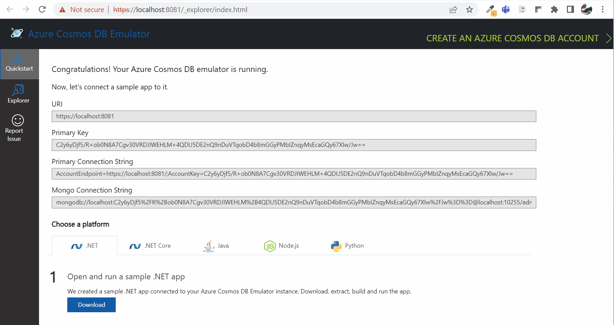

# Getting Started with Cosmos DB

## Use Cosmos DB Emulator

Install Cosmos DB Emulator using Chocolatey:

```
choco install azure-cosmosdb-emulator -y
```

Run the emulator using the start menu:

  

> Note: As an alternative you could also use the container version of the emulator [Run the emulator on Docker for Linux](https://learn.microsoft.com/en-us/azure/cosmos-db/docker-emulator-linux?tabs=sql-api%2Cssl-netstd21)

## Run Queries on Cosmos DB

[Getting started with SQL queries](https://docs.microsoft.com/en-us/azure/cosmos-db/sql/sql-query-getting-started)

## Demo

-   Create SQL DB in Portal
-   Upload `food.json`
-   Show Queries, Stats, Indexing

### Basic Query Syntax

Sample entity:

```json
{
    "id": "9",
    "name": "Kaeng Masaman",
    "amount": 16,
    "pictureUrl": null,
    "code": "mmc",
    "date": "2022-03-19T00:00:00",
    "kitchen": "Thai",
    "tags": [
        "Mild",
        "Asia",
        "Curry"
    ],
    "protein": [
        "beef",
        "chicken"
    ],
    "servings" : [
        {
            "type": "starter",
            "size": "300ml"
        },
        {
            "type": "full",
            "size": "500ml"
        }
    ],
    "reviews": 0
}
```

Execute query for id:

```sql
SELECT *
FROM food f
WHERE f.id = '1'
```

Execute query for kitchen:

```sql
SELECT *
FROM f
WHERE f.kitchen = "Thai"
ORDER by f.amount DESC
```

Using alias:

```sql
SELECT
    f.name,
    (f.amount * 1.2) AS Brutto
FROM food f
```

Products to those that have a price that is 10 and 20:

```sql
SELECT
    f.name,
    f.kitchen
FROM
    food f
WHERE
    f.amount >= 10 AND
    f.amount <= 20
```

Get all kitchens in a distinct list:

```sql
SELECT DISTINCT VALUE
    f.kitchen
FROM
    food f
```

VALUE operator flattens the result nesting:

```sql
SELECT DISTINCT VALUE
    f.servings.type
FROM
    food f
```

Joins are scoped to a single item. A JOIN creates a cross-product between different sections of a single item

```sql
SELECT
    f.name,
    s.type as Type
FROM 
    food f
JOIN
    s IN f.servings  
```

JOIN expressions can also include correlated subqueries to narrow the result

```sql
SELECT VALUE v
FROM v IN f.servings
WHERE v.type = "starter"
```

Query different documents that are stored in the same collection. This would allow you to query for all orders for a specific customer with a single query

```sql
SELECT * 
FROM customer_orders c 
WHERE c.customerId = 1
```