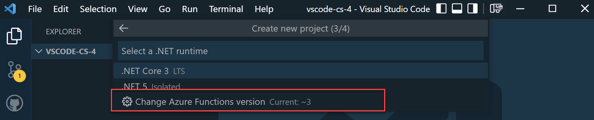
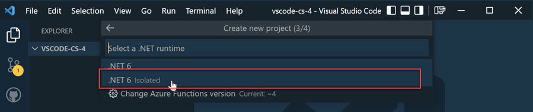
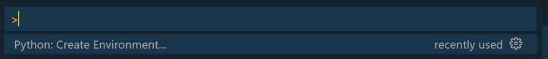

# Azure Function Local Development using Azure Function Core Tools

This demo will show how to create a Function App using Visual Studio Code and Azure Function Core Tools. 

The current version of the [Azure Function Extension](https://marketplace.visualstudio.com/items?itemName=ms-azuretools.vscode-azurefunctions) is based on [Python 3.11](https://www.python.org/downloads/release/python-3110/)

## References

[Work with Azure Functions Core Tools](https://docs.microsoft.com/en-us/azure/azure-functions/functions-run-local?tabs=v3%2Cwindows%2Ccsharp%2Cportal%2Cbash)

[host.json Reference](https://docs.microsoft.com/en-us/azure/azure-functions/functions-host-json)

[Microsoft Azure Functions using Spring integration](https://docs.spring.io/spring-cloud-function/docs/current/reference/html/azure.html)

## Demos

- Use Azure Function Core Tools
- Demo VS Code Function Apps
- Use Langchain in Azure Function Python

### Use Azure Function Core Tools

#### Environment Setup

Install azure-function-tools:

```
npm i -g azure-functions-core-tools@4 --unsafe-perm true
```

Install [Azurite Storage Emulation](https://docs.microsoft.com/en-us/azure/storage/common/storage-use-azurite?tabs=visual-studio):

```bash
npm install -g azurite
```

Run Azurite in console:

```bash
azurite
```

#### Selecting Runtime Version

Install [Azure Function - Visual Studio Code Extension](https://marketplace.visualstudio.com/items?itemName=ms-azuretools.vscode-azurefunctions)





#### Testing Options

To Execute REST Calls you could use:

-   [REST Client - Visual Studio Code Extension](https://marketplace.visualstudio.com/items?itemName=humao.rest-client) with [instructions](https://github.com/Huachao/vscode-restclient/blob/master/README.md)
-   [az rest](https://docs.microsoft.com/en-us/cli/azure/reference-index?view=azure-cli-latest#az_rest)
-   [Postman](https://www.postman.com/)
-   [httprepl](https://docs.microsoft.com/en-us/aspnet/core/web-api/http-repl/?view=aspnetcore-6.0&tabs=windows)

Install httprepl which used in labs:

```
dotnet tool install -g Microsoft.dotnet-httprepl
```

### Demo VS Code Function Apps

Create Function App in Azure by executing `create-vscode-app.azcli`

Create a function project:

```
func init vscode-func --dotnet
```

Create a new Function:

```
func templates list
func new -n GreetingFunctions --template "Http Trigger"
```

>  **Note**: If you get an `No templates found matching: 'HTTPtrigger'` error this can be caused by multiple versions of the .NET SDK being installed on your machine. You can fix this issue by creating a `global.json` using `dotnet new global.json` an by setting the correct framework version.

Run function locally:

```
func start
```

Use az rest in another terminal instance:

```bash
az rest -m post -u http://localhost:7071/api/MyHttpTrigger -b "{'name':'Azure Rocks'}"
```

Use `REST Client` and execute `send-greeting.http`:

```bash
@baseurl=localhost:7071

### Greet Hubertus using POST
POST  {{url}}/api/greetAnonymous HTTP/1.1
content-type: application/json

{
    "name": "Alois"
}
```

TO create Function App Host in Azure execute `create-vscode-app.azcli`

Publish App to Azure using CLI:

```bash
cd vscode-cs
func azure functionapp publish $app
cd ..
```

### Use Langchain in Azure Function Python

This demo shows how to create a Function App using Python and LangChain.

- Install the [Python Environment Manager](https://marketplace.visualstudio.com/items?itemName=donjayamanne.python-environment-manager) extension in Visual Studio Code.

- Setup the environment using F1 - Create Python Environment.

    

- Select Venv as the environment and select the Python version (3.11). Install packages using pip.

        