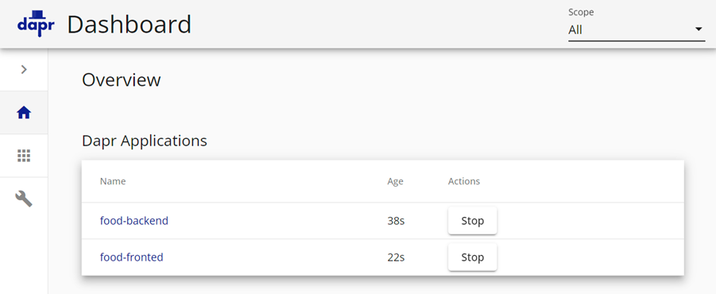

# Environment Setup, Debugging & State Management

This modules demonstrates how to code & debug a Dapr based microservices as well as to deploy it to Azure Container Apps. It is based on the [Dapr quickstarts](https://docs.dapr.io/getting-started/quickstarts/). 

- [food-api-dapr](./food-api-dapr/) - A .NET Core Web API project that uses State Management to store and retrieve state. 

Configuration of of [Dapr components](https://docs.dapr.io/concepts/components-concept/) is stored in the [components](/components/) folder of the apps base directory. During development it will use `Redis` as the default state store. When deploying it will use Azure Blob Storage. We could also use Azure Cosmos DB as a state store just by changing the state store configuration.

- `statestore.yaml` - Configures the state store to use Azure Blob Storage.

    ```yaml
    apiVersion: dapr.io/v1alpha1
    kind: Component
    metadata:
    name: foodstore
    spec:
    type: state.redis
    version: v1
    metadata:
    - name: redisHost
        value: localhost:6379
    - name: redisPassword
        value: ""
    ```

    


## Docs & Resources

[Dapr Overview](https://docs.dapr.io/concepts/overview/)

[Dapr CLI](https://docs.dapr.io/reference/cli/cli-overview/)

[Dapr Visual Studio Code extension](https://docs.dapr.io/developing-applications/local-development/ides/vscode/vscode-dapr-extension/)

## Getting started, Basic State & Deployment to Azure Container Apps


- Install Dapr CLI

    ```
    Set-ExecutionPolicy RemoteSigned -scope CurrentUser
    powershell -Command "iwr -useb https://raw.githubusercontent.com/dapr/cli/master/install/install.ps1 | iex"
    ```

    >Note: Restart the terminal after installing the Dapr CLI

- Initialize default Dapr containers and check running containers:

    ```bash
    dapr init
    ```

    

   >Note: To remove the default Dapr containers run `dapr uninstall` 

- Run project [food-api-dapr](../00-app/food-api-dapr/)

    ```
    dapr run --app-id food-api --app-port 5000 --dapr-http-port 5010 --resources-path './components' dotnet run
    ```

    >Note: By default the --app-port is launching the https-profile from launchSettings.json. With .NET 7+ you can choose the profile by using the `--launch-profile` parameter.

- Test the API by invoking it several times using the dapr sidecar. The sidecar that listens to port `5010` forwards the request to the app. The sidecar is also responsible for service discovery and pub/sub.

    ```bash
    GET http://localhost/<dapr-http-port>/v1.0/invoke/<app-id>/method/<method-name>
    GET http://localhost:5010/v1.0/invoke/food-api/method/food
    ```

- Show Dapr Dashboard

    ```
    dapr dashboard
    ``` 

- Examine Dapr Dashboard on http://localhost:8080:

    


### Using Default State Store

- Add DaprClient to `Program.cs`

    ```c#
    var builder = WebApplication.CreateBuilder(args);
    ...
    // Add DaprClient to the ioc container
    builder.Services.AddDaprClient();
    ```
- Examine `CountController.cs` and call `getCount()` multiple times to increment the counter and receive its current value:

    ```c#
    public CountController(DaprClient daprClient)
    {
        client = daprClient;
    }

    [HttpGet("getCount")]
    public async Task<int> Get()
    {
        var counter = await client.GetStateAsync<int>(storeName, key);
        await client.SaveStateAsync(storeName, key, counter + 1);
        return counter;
    }
    ```

- To increment the counter you can use the pre-configured REST calls in [test-dapr.http](./food-api-dapr/test-dapr.http) which is using the [Rest Client for Visual Studio Code Extension](https://marketplace.visualstudio.com/items?itemName=humao.rest-client).      

    ```bash
    @baseUrl = http://localhost:5000
    ### Get the count and increment it by 1
    GET {{baseUrl}}/count/getcount HTTP/1.1
    ```

- Check the state store data in the default state store - Redis:

    ```bash
    dapr state list --store-name statestore
    ```   

- Examine the `Dapr Attach` config in `launch.json` and use it to attach the debugger to the `food-api-dapr` process and debug the state store code:

    ```json
    {
        "name": "Dapr Attach",
        "type": "coreclr",
        "request": "attach",
        "processId": "${command:pickProcess}"
    }
    ```
    

### Deploy to Azure Container Apps

- Build the food-api-dapr image

    ```bash
    env=dev
    grp=az-native-$env
    loc=westeurope
    acr=aznative$env
    az acr build --image $img--registry $acr --file dockerfile .
    ```
- Create a storage account to be used as state store

    ```bash
    stg=aznative$env
    az storage account create -n $stg -g $grp -l $loc --sku Standard_LRS
    ```

- Update its values in `components/statestore-blob.yaml`

    ```yaml
    apiVersion: dapr.io/v1alpha1
    kind: Component
    metadata:
    name: <NAME>
    spec:
    type: state.azure.blobstorage
    version: v1
    metadata:
    - name: accountName
        value: "[your_account_name]"
    - name: accountKey
        value: "[your_account_key]"
    - name: containerName
        value: "[your_container_name]"
    ```        

- Add the Dapr component to the Azure Container Apps environment

    ```bash
    az containerapp env dapr-component set -n $acaenv -g $grp \
    --dapr-component-name statestore \
    --yaml './statestore-blob.yml'
    ```    
    >Note. In Azure Portal you can also create the Dapr component in the Azure Container Apps environment. It allows you to choose between Redis, Azure Blob Storage, Azure Cosmos DB and others as a state store. The interaction with the specifics of the state store is abstracted away by Dapr:

    


- Execute deploy-app.azcli to create the container app

    ```bash
    az containerapp create -n $appBackend -g $grp \
    --image $imgBackend \
    --environment $acaenv \
    --target-port 80 --ingress external \
    --min-replicas 0 --max-replicas 1 \
    --enable-dapr \
    --dapr-app-port 80 \
    --dapr-app-id $appBackend \
    --registry-server $loginSrv \
    --registry-username $acr \
    --registry-password $pwd 
    ```

    >Note: Accessing ACR could also done using a managed identity. Check the [documentation](https://learn.microsoft.com/en-us/azure/container-apps/managed-identity-image-pull?tabs=azure-cli&pivots=command-line) for more details.

- Execute the /count/getCount method multiple times to increment the counter

    ```bash
    curl -X GET "http://<URL>.$loc.azurecontainer.io/count/getCount" -H  "accept: text/plain"
    ```

- Examine the storage account to see the state store data

    
