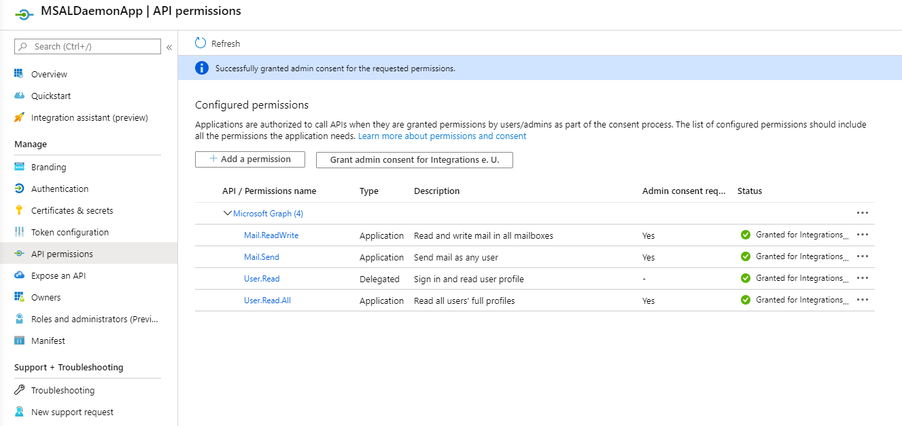

# MSAL secured Mail Daemon Service with Microsoft Graph

[Microsoft Graph SDKs](https://docs.microsoft.com/en-us/graph/sdks/sdks-overview?view=graph-rest-1.0)

[Microsoft Graph REST API v1.0 reference](https://docs.microsoft.com/en-us/graph/api/overview?view=graph-rest-1.0)

[Microsoft Graph Explorer](https://developer.microsoft.com/en-us/graph/graph-explorer)

## Demos

- Explain Daemon App using Credential Flow & Secret
- Explain MS Graph

Permissions for Daemon App:

