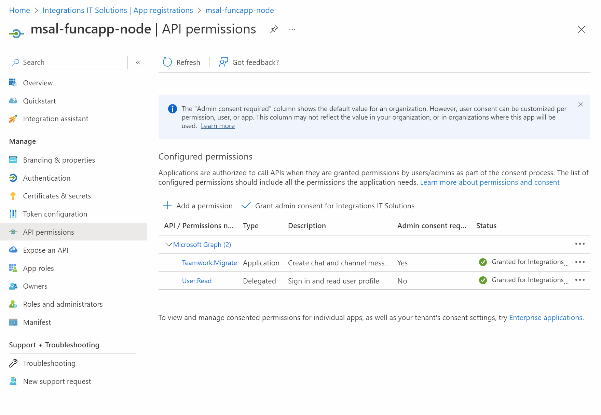

# Post to Microsoft Teams using Graph REST API and Azure Function

- Create the app registration by executing `create-confidential-appreg.azcli`:

    

    

- Add the clientId and the secret to the `local.settings.json` file of `post-teams-func`:

```json
{
    "IsEncrypted": false,
    "Values": {
        "AzureWebJobsStorage": "UseDevelopmentStorage=true",
        "FUNCTIONS_WORKER_RUNTIME": "node",
        "clientID": "4d4baad2-6a42-4dc4-8784-3ac35317e6ec",
        "secret": " <SECRET>",
        "tenantID": "d92b247e-90e0-4469-a129-6a32866c0d0a",
        "redirectUri": "http://localhost:7071"
    }
}
```

        