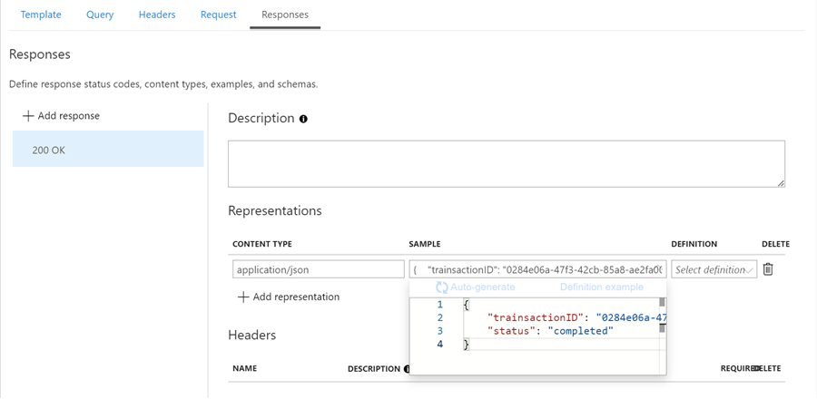

# Sending Mock Responses using Policies

[API Management Policies](https://docs.microsoft.com/en-us/azure/api-management/api-management-policies)

## Demo

- Create an in-portal http-trigger `execPayment` function on `foodpayments-dev` and add it to apim:

    ```typescript
    module.exports = async function (context, req) {
        context.log('Executing payment');   
        const responseMessage = { "paymentRequest": "pending", "transactionID": '0284e06a-47f3-42cb-85a8-ae2fa0075132'}
        context.res = {
            body: responseMessage
        };
    }
    ```
- Execute and test it

- Add a `mock-response` policy for `200 OK, application/json`

    ```xml
    <inbound>
        <base />
        <set-backend-service id="apim-generated-policy" backend-id="foodpayment-dev" />
        <mock-response status-code="200" content-type="application/json" />
    </inbound>
    ```

- To add the mock response select the `POST` operation, select the `Design` tab and in Frontend chose the `Form-based editor`. In the `Responses` tab add a `200 OK` response with the following body:
  
    ```json
    {
        "trainsactionID": "0284e06a-47f3-42cb-85a8-ae2fa0075132",
        "status": "completed"
    }
    ```

    