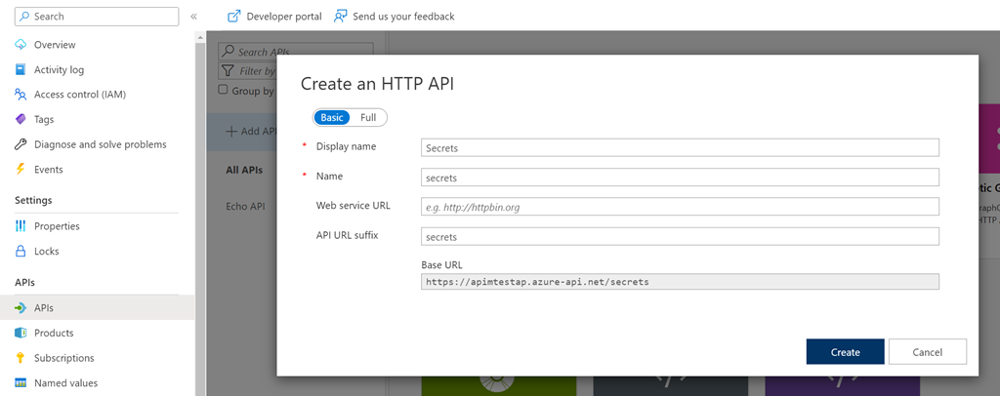

# Assign MI to Apim Service to access Key Vault (optional)

- Create a Secrets Api in apim

    

- Add an operation getSecret and assign the following inbound policy

    ```xml
    <inbound>
        <base />
        <send-request mode="new" response-variable-name="secretResponse" timeout="20" ignore-error="false">
            <set-url>https://foodvault-staging.azure.net/secrets/apimsecret/?api-version=7.3</set-url>
            <set-method>GET</set-method>
            <authentication-managed-identity resource="https://vault.azure.net" />
        </send-request>
        <set-variable name="secretVar" value="@{
            var secret = ((IResponse)context.Variables["secretResponse"]).Body.As<JObject>();
            return "/getsecret/" + secret["value"].ToString() + "/";
        }" />
        <rewrite-uri template="@((string)context.Variables["apimsecret"])" />
    </inbound>
    ```

- Test the operation
        