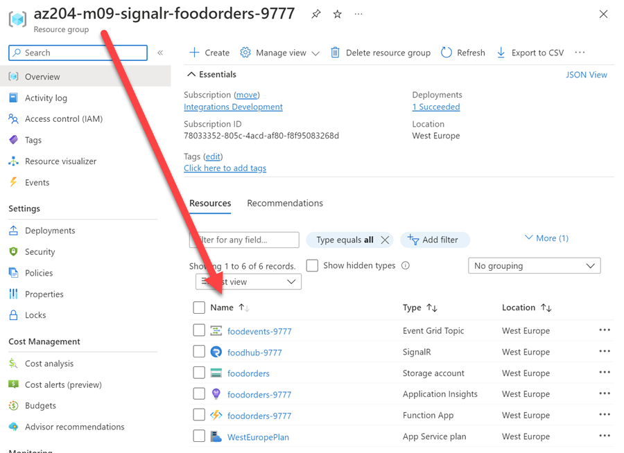

# Real-time connected Angular Microfrontend using Azure Event Grid and SignalR

[Food orders dashboard](/app/food-orders-dashboard/) `food-orders-ui` imlplemented as Angular Microfronend using `@ngrx/component-store`

[Food orders dashboard function](/app/food-orders-dashboard-func/) that acts as an endpoint for the event grid topic webhook subscription and communicates with the SignalR service that provides a real time connection to the orders dashboard


## Readings

[CloudEvent schema](https://docs.microsoft.com/en-us/azure/event-grid/cloudevents-schema)

[SignalR](https://docs.microsoft.com/en-us/azure/azure-signalr)

## Demo

-   Event Grid Topic receives a CloudEvent triggered by `post-order.http`
-   A function app with that:
    -   Acts as an endpoint for the event grid topic webhook subscription using a binding
    -   Communicates with the SignalR service that provides a real time connection to the orders dashboard

### Setup & Steps

-   Install the [Azure Functions Core Tools](https://docs.microsoft.com/en-us/azure/azure-functions/functions-run-local#v2) and [Azure CLI](https://docs.microsoft.com/en-us/cli/azure/install-azure-cli?view=azure-cli-latest) and login to your [Azure tenant](https://azure.microsoft.com/en-us/free/).

-   Execute `create-foodorder-app.azcli` in [wsl bash](https://learn.microsoft.com/en-us/windows/wsl/install) to provision the environment and deploy the function app. Navigate to the Azure portal and check that the ressources have been created.

    

-   Update SignalR config key `fxEndpoint` in `environment.ts` of `food-orders-ui` using the values from the terminal of the previous step.

    

    ```typescript
    export const environment = {
        production: false,
        fxEndpoint: 'https://foodorders-7325.azurewebsites.net/api',
    };
    ```

-   Start the microfrontend using `ng serve` in `food-orders-dashboard` and open [http://localhost:4200](http://localhost:4200). Open the F12 Dev tools and check that the SignalR connection is established.

    

-   Send a mock CloudEvent using `post-order.http` by updating `@topicurl` and `@topickey` with the values from the terminal:

    ```
    @topicurl=foodtopic-prod.westeurope-1.eventgrid.azure.net
    @topickey=C1q1BdqhPGsNsmy5wBzjtsgTTN1u2GbiffNoU8EJlcM=

    POST  https://{{topicurl}}//api/events HTTP/1.1
    content-type: application/cloudevents+json; charset=utf-8
    aeg-sas-key: {{topickey}}

    { ...
    ```


https://user-images.githubusercontent.com/16348023/201038870-7420343a-f847-443d-9b25-2df2f71c44e5.mp4


> Credits: The demo is an updated and modernized version of [https://github.com/DavidGSola/serverless-eventgrid-viewer](https://github.com/DavidGSola/serverless-eventgrid-viewer)
