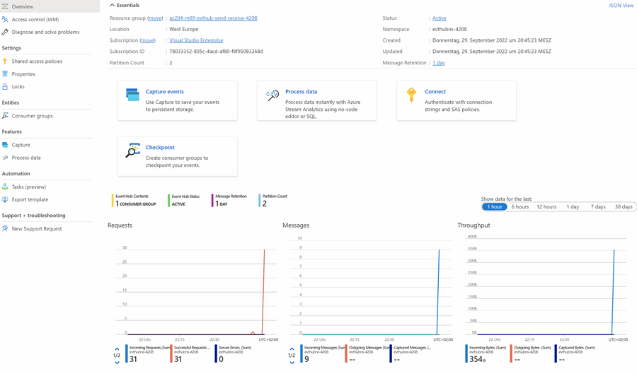

# Event Hub Demo

- Execute `create-event-hub-cli.azcli`
- Run SendEvents and check in Event Hub (might take a few minutes)

    ```
    dotnet run
    ```

    ] 

- Run ReceiveEvents

    ```
    dotnet run
    ```