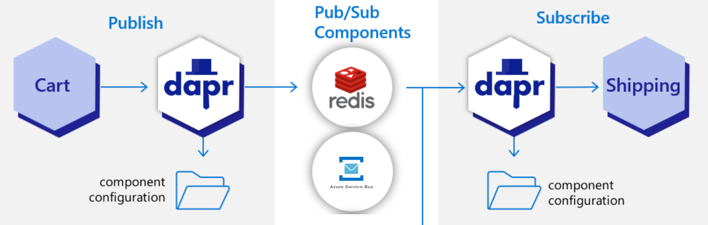

# Dapr Pub / Sub

Dapr pub/sub building block provides a platform-agnostic API framework to send and receive messages. The publisher services publish messages to a named topic. Your consumer services subscribe to a topic to consume messages:


- `pubsub.yaml`:

    ```yaml
    apiVersion: dapr.io/v1alpha1
    kind: Component
    metadata:
    name: food-pubsub
    spec:
    type: pubsub.redis
    version: v1
    metadata:
        - name: redisHost
        value: localhost:6379
        - name: redisPassword
        value: ""
    ```
    

### Publisher    

- Examine [FoodController.cs](./food-api-dapr/Controllers/FoodController.cs) 

    ```c#
    [HttpPost("add")]
    public async Task<FoodItem> AddFood([FromBody] FoodItem food)
    {
        logger.LogInformation("Started processing message with food name '{0}'", food.Name);
        var existing = ctx.Food.FirstOrDefault(f => f.ID == food.ID);
        if (existing != null)
        {
            ctx.Attach(food); 
            ctx.Entry(food).State = EntityState.Modified;
        }
        else
        {
            ctx.Food.Add(food);
            logger.LogInformation("Food with ID '{0}' does not exist. Adding it", food.ID);
        }
        await ctx.SaveChangesAsync();
        await PublishFoodAdded(food);
        return food;
    }
    ```

- Examine `PublishFoodAdded()`. It is responsible for publishing the food item to the Dapr Pub/Sub component:

    ```c#
    private async Task PublishFoodAdded(FoodItem food)
    {
        var pubsubName = cfg.GetValue<string>("PUBSUB_NAME");
        var topicName = cfg.GetValue<string>("PUBSUB_TOPIC");            
        await client.PublishEventAsync(pubsubName, topicName, food);
    }
    ```

    >Note: The `PublishEventAsync` method is used to publish the food item to the pub/sub component. `food-pubsub` is the name of the pub/sub component and `food-items` is the topic name.

- Run the api with Dapr and add the pub/sub component from the components folder:

    ```bash
    dapr run --app-id food-fronted --app-port 5002 --dapr-http-port 5011 --resources-path './components' dotnet watch run       
    ```

    >Note: The `--resources-path` parameter is used to specify the location of the components folder. It adds all the components of the folder to the app. Previously we used `--components-path` to add components. In `tasks.json` this is still the case.

### Subscriber

- [food-invoices-dapr](./food-invoices-dapr/) subscribes to the topic. Examine its [Program.cs](./food-invoices-dapr/Program.cs) and notice the following code:

    ```c#
    builder.Services.AddDapr();
    ...
    app.UseCloudEvents();
    ...
    app.MapSubscribeHandler();    
    ```

- `AddDapr()` registers the necessary services to integrate Dapr into the MVC pipeline. It also registers a `DaprClient` instance into the dependency injection container. 
- `UseCloudEvents()` adds CloudEvents middleware into the ASP.NET Core middleware pipeline. This middleware will unwrap requests that use the CloudEvents structured format, so the receiving method can read the event payload directly.
- `MapSubscribeHandler()` registers a route handler for the `dapr/subscribe` endpoint. This endpoint is used by Dapr to register the subscriber with the pub/sub component. The route handler will read the topic name from the request and register the subscriber with the pub/sub component.  

- [InvoicesController](./food-invoices-dapr/Controllers/InvoiceController.cs) is responsible for receiving the food items and creating invoices:

    ```c#
    [HttpPost]
        [Dapr.Topic("food-pubsub", "food-items")]
        public ActionResult CreateInvoice([FromBody] FoodItem food )
        {
            // Create invoice
            ...
            return Ok("Invoice Created");
        }    
    ```

    >Note: The `Topic` attribute is used to register the subscriber with the pub/sub component. `food-items` is the topic name and `food-pubsub` is the name of the pub/sub component.

- Start the subscriber using Dapr:

    ```bash
    dapr run --app-id food-invoices --app-port 5003 --dapr-http-port 5012 --resources-path './components' dotnet watch run
    ```    

- To publish an item use:

    ```
    POST http://localhost:5011/v1.0/publish/food-pubsub/food-items HTTP/1.1
    content-type: application/json

    {
        "id": 12,
        "name": "Pad Kra Pao",
        "price": 12.0,
        "inStock": 9,
        "pictureUrl": null,
        "code": "kra"
    }
    ```