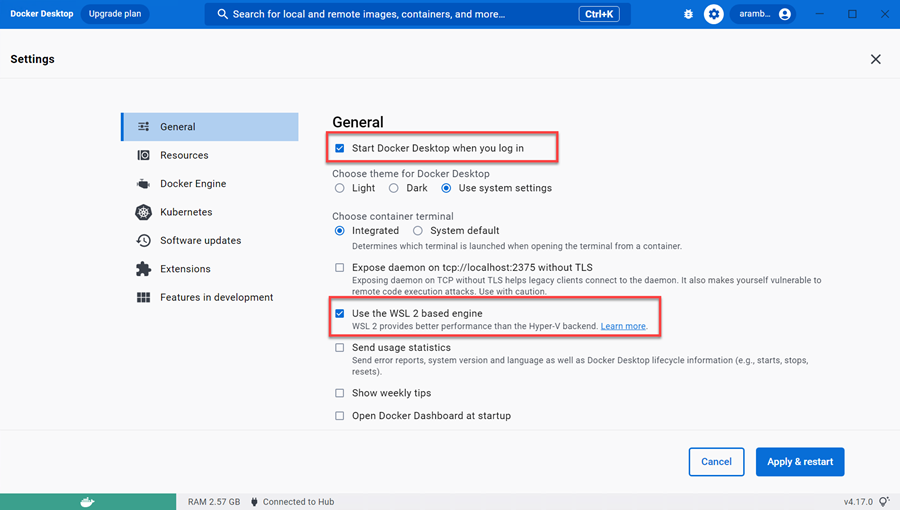
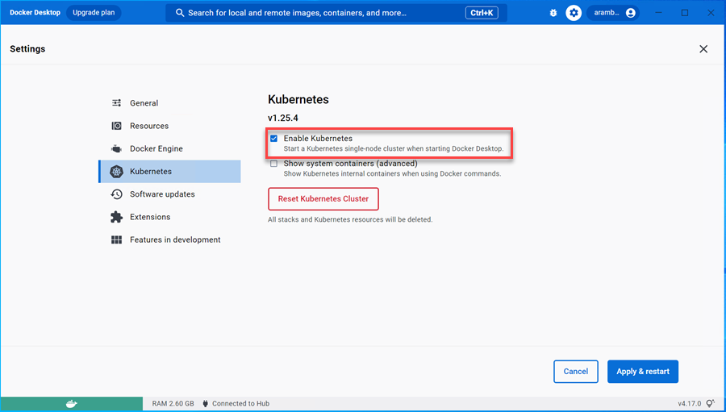
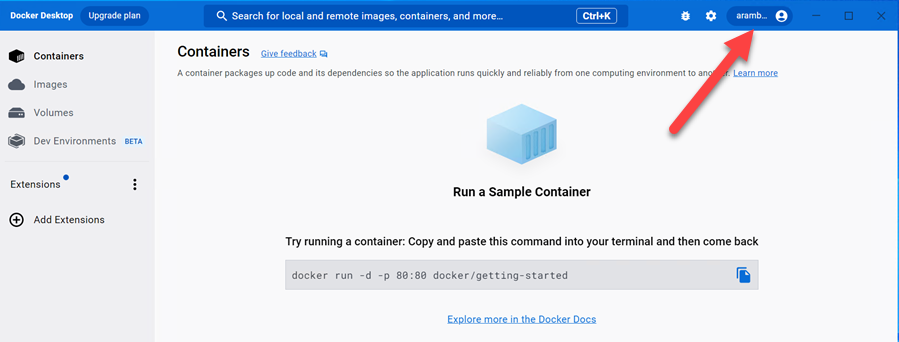

# Setup local container support

This requires prev step - WSL Installation

Download & Install [Docker Desktop for Windows](https://desktop.docker.com/win/main/amd64/Docker%20Desktop%20Installer.exe?utm_source=docker&utm_medium=webreferral&utm_campaign=dd-smartbutton&utm_location=header) or execute:

```powershell
choco install docker-desktop -y
logoff
```

Double Click on `Docker Desktop Icon` that will be present on the Windows Desktop, to start the installation. After installation you will be asked to log out and log in again.

Configure Docker:



Enable Kubernetes:



Press Appy & Restart to complete Docker Setup

Create an account at [Docker Hub](https://hub.docker.com/) and signin to Docker



## Test Installation

In the console window execute:

```
docker run hello-world
```

