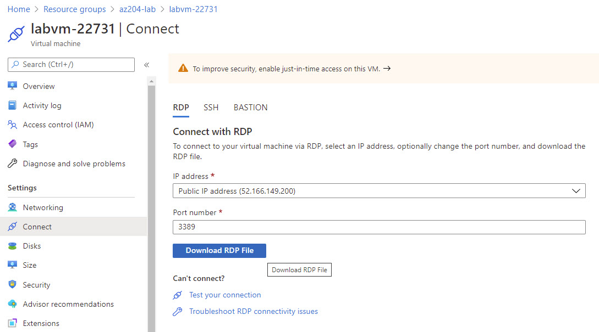
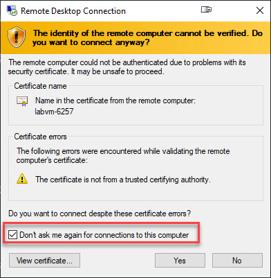

# Create Lab VM - Optional

Execute `create-lab-vm.azcli` or run the following remote script in Cloud Shell

```bash
curl https://raw.githubusercontent.com/arambazamba/ng-adv/main/setup/lab-vm/create-lab-vm.azcli | bash
```


`create-lab-vm.azcli`:

```bash
env=$RANDOM
loc=westeurope
grp=ng-adv
vmname=ng-adv-$env
user=labadmin
pwd=Lab@dmin1234

az group create -n $grp -l $loc

az vm create -g $grp -n $vmname --admin-username $user --admin-password $pwd \
    --image MicrosoftWindowsDesktop:Windows-10:win10-22h2-pro-g2:latest \
    --size Standard_E2s_v5 --public-ip-sku Standard
```

Connect to VM:

Go to Ressource Group `az-lab` and connect to VM using RDP and the credentials that you have used in the script:

Download RDP File:



Optional - Disable Login:


Sign In & Remember:



Credentials:

```
user=labadmin
pwd=Lab@dmin1234
```


Accept Settings:


