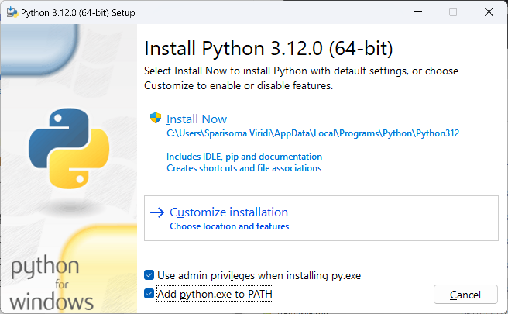

# Python Quickstarts

- Setup Python
- Create a Virtual Environment

## Setup Python

- Install Python in WSL:

    ```bash
    sudo apt update && sudo apt upgrade
    sudo apt install python3-pip
    sudo apt install python3-venv
    ```

- Install Python on Windows:

    - [Download Python](https://www.python.org/downloads/)

    >Note: Make sure you check the box that says "Add Python to PATH" during installation.

    

    - [Get started using Python for web development on Windows](https://learn.microsoft.com/en-us/windows/python/web-frameworks)    

    >Note: You could also use `setup-python.ps1`

## Create a virtual environment    

A virtual environment is a self-contained directory tree that contains a Python installation for a particular version of Python, plus a number of additional packages.

- Create a virtual environment (WSL)

    ```bash
    python3 -m venv <ENV_NAME>
    source <ENV_NAME>/bin/activate
    ...
    python3 -m venv basics
    ``` 

- Create a virtual environment (Windows)

    ```bash
    python3 -m venv <ENV_NAME>
    source <ENV_NAME>/bin/activate
    ...
    python -m venv venv
    venv/scripts/activate
    ``` 

    >Note: If you decide to call your virtual environment other than `venv`, make sure to add it to your `.gitignore` file.

    ```bash
    **/basics/
    ```