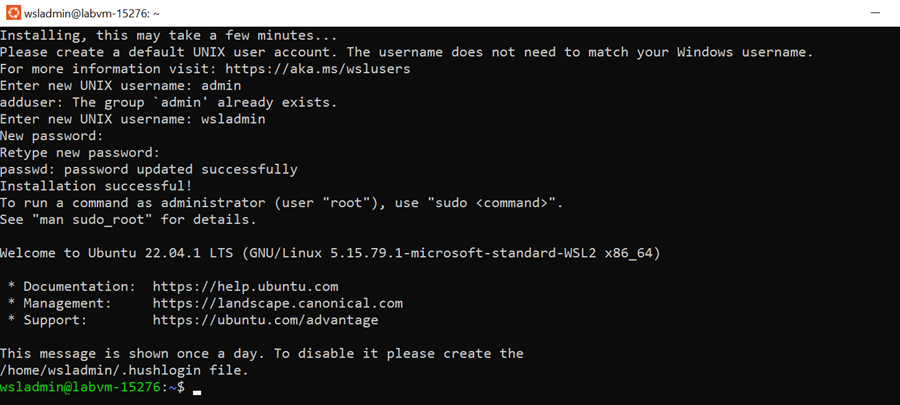

# Setup Windows Subsystem for Linux 2 - WSL2

Requires Windows 10 - May 2020 Update or higher. To Update use this [link](https://www.microsoft.com/de-de/software-download/windows10).

[Install WSL 2](https://docs.microsoft.com/en-us/windows/wsl/install) in a Powershell Prompt:

```powershell
wsl --install
Restart-Computer
```

Finish installation of Ubuntu 20.04 LTS from the Microsoft Store and set wsl user and password:

```
user=labadmin
pwd=Lab@dmin1234
```



## WSL Frameworks & Runtimes Setup

[Introduction to Bash Scripting](https://www.taniarascia.com/how-to-create-and-use-bash-scripts/)

### Node & Angular CLI

Install NVM (Node Version Manager):

```bash
sudo apt-get install curl
curl -o- https://raw.githubusercontent.com/nvm-sh/nvm/master/install.sh | bash
sudo apt-get install build-essential
```

Install & use Node 16.x using NVM:

```bash
nvm install 16.15.0
nvm use 16.15.0
```

Install Angular CLI:

```bash
npm install -g @angular/cli
``` 

#### .NET 6 SDK - Optional

>Note: All required .NET Api's are available containerized at [https://hub.docker.com/repositories/alexander-kastil](https://hub.docker.com/repositories/alexander-kastil) if you want to skip .NET SDK installation. You need to sign up for a [free Docker Hub account](https://hub.docker.com/) to access the images.

Install .NET 6 SDK:

```
wget https://packages.microsoft.com/config/ubuntu/20.10/packages-microsoft-prod.deb -O packages-microsoft-prod.deb
sudo dpkg -i packages-microsoft-prod.deb
sudo apt-get update; \
sudo apt-get install -y apt-transport-https && \
sudo apt-get update && \
sudo apt-get install -y dotnet-sdk-6.0
```

### Azure CLI

```
sudo apt install curl
curl -sL https://aka.ms/InstallAzureCLIDeb | sudo bash
az config set extension.use_dynamic_install=yes
```