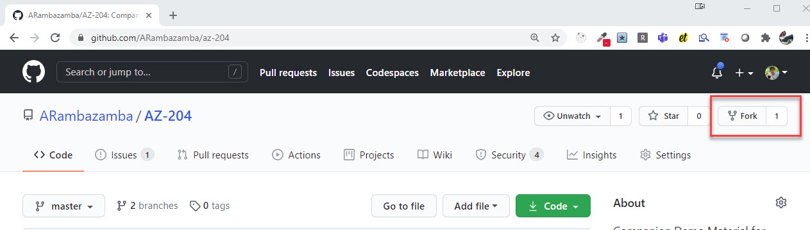

# Getting Started

To avoid problems with saved credentials I recommend using an alternate browser or log of all accounts in your browser before starting the lab.

- [Get the Azure Pass from the GoDeploy Lab](../09-godeploy-lab)
- [Register your Azure Pass](../05-azurepass)
- [Configure CloudShell for first use in your Azure Tenant](../04-cli/#configure-cloud-shell)
- [Register GitHub Account](https://github.com/)
- Configure Git on the Lab VM
- Setup Git and Fork the class repo

## Configure Git on the Lab VM

Set User and E-Mail in order to be able to commit to git:

```bash
git config --global user.name "Your Name"
git config --global user.email "your.email@yourdomain.com"
```

## Setup Git and Fork the class repo

Go to `https://github.com/alexander-kastil/az-204` and fork the repo or use the GitHub CLI:

```
gh repo fork https://github.com/alexander-kastil/az-204
```



The forking-workflow allows you to commit your changes to your fork of the repo and still get updates on the repo


Clone Class Repo:

```bash
git clone https://github.com/Student01/az-204
```

> Note: If you have forked the class repo clone your own fork, otherwise use https://github.com/alexander-kastil/az-204