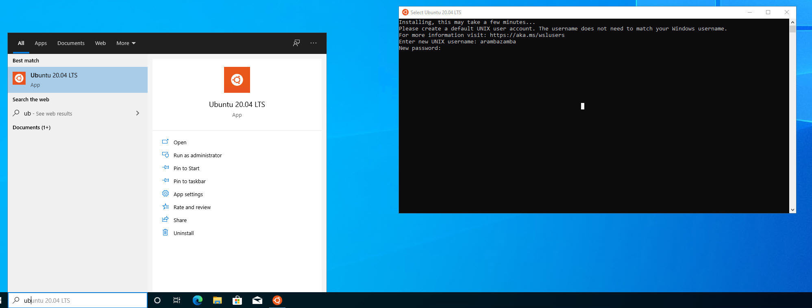
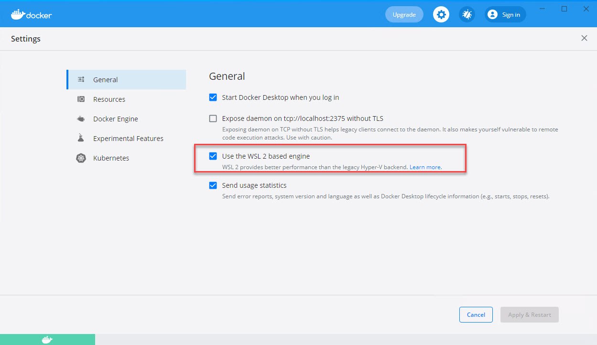

# Setup Docker & Windows Subsystem for Linux WSL

## Setup Docker Support - optional

There are two options to configure Docker support. WSL2 recommended

In order for Docker to work on a Windows 10 VM you need to install Hyper-V or use Windows Subsystem for Linux 2 (WSL2). Therefore you must use hardware that supports [Nested Virtualization](https://docs.microsoft.com/en-us/azure/lab-services/how-to-enable-nested-virtualization-template-vm). A detailed Setup Guide can be found [here](https://github.com/alexander-kastil/ClassSetup).

### Install Docker with WSL2

Open PowerShell as Administrator and run:

```powershell
wsl --install
```

Reboot your machine & open WSL and set your root user & password. I.e.:

```
user=azlabadmin
pwd=Lab@dmin1234
```



Install Docker Desktop using an elevated Powershell:

```
choco install docker-desktop -y
```


Log off and on after installation:


> Note: Enter `logoff` in the current console

Start Docker Desktop and switch to settings:


Check the WSL2 settings:



---

### Test Docker Installation

In the console window execute:

```
docker run hello-world
```


## <a id="teams">Optional - Using Teams in VM</a>

To avoid switching between Host an VM you can use Microsoft [Teams Web Client](http://teams.microsoft.com) to see all Chat messages