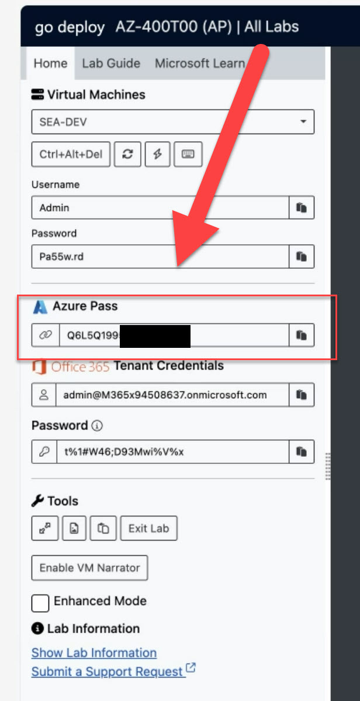

# GoDeploy

The GoDeploy Lab is a lab environment that is used for the AZ-400 course. You can access the lab environment using [https://lms.godeploy.it/](https://lms.godeploy.it/)

- Add a lab using your lab key
- Start the lab
- Copy the Azure Pass Key. You will need this to activate your Azure Subscription

    